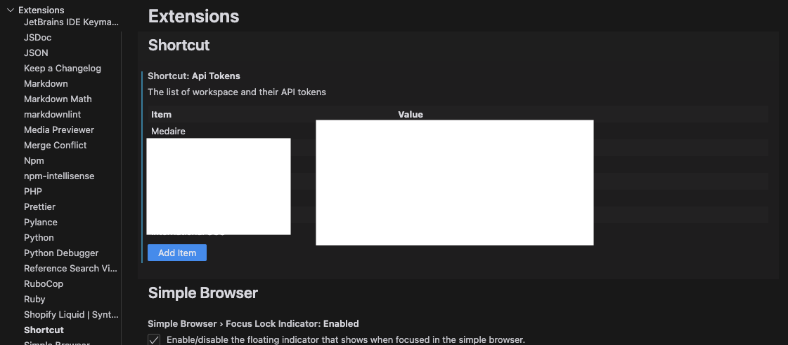
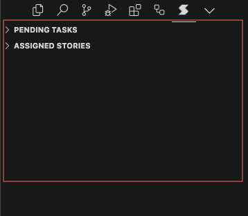

# VSCode Shortcut Extension

This extension helps you manage your [Shortcut](https://www.shortcut.com/) stories from within VSCode. It seamlessly integrates with Shortcut to display assigned stories across all your workspaces. It also displays stories that have a task assigned to you.

## Features

- View all pending tasks from your Shortcut stories across all your workspaces
- View all assigned stories across all your workspaces
- Open stories from within VSCode
- Mark as task as done from within VSCode
- Copy the github branch helper for an assigned story

## Requirements

- A Shortcut account and API token
- Visual Studio Code version 1.60.0 or higher

## Extension Settings

This extension has the following settings:

- `shortcut.apiTokens`

## Setup

1. Install the extension from the VS Code marketplace
2. Open VS Code settings
3. Add your Shortcut API tokens for each workspace in the `shortcut.apiTokens` settings
4. The settings should look like this:

```json
{
    "shortcut.apiTokens": {
        "Workspace One": "11111111-1111-1111-1111-111111111111",
        "Workspace Two": "22222222-2222-2222-2222-222222222222"
    }
}
```



## Usage

1. There is a new menu item in the activity bar called "Shortcut"

2. Clicking on the menu item will open the Shortcut view

3. The view will display all stories assigned to you across all your workspaces in a tree
4. The view will also display all stories that have a task assigned to you
5. There is an action on the story node to open the story in Shortcut
6. There is an action on the task node to mark the task as done
7. There is an action on the story node to copy the github branch helper for an assigned story

## Known Issues

Please take a look at the [issues](https://github.com/shortcut-tools/vscode-shortcut/issues) page for any known issues.

## See [CHANGELOG](./CHANGELOG.html) for Release Notes

## Contributing

Found a bug or have a feature request? Please open an issue on our GitHub repository.
Also take a look at [documentation](https://anirvanmandal.github.io/vscode-shortcut/docs/) for more information on how to contribute to this project.

**Enjoy managing your Shortcut stories directly in VSCode!**
